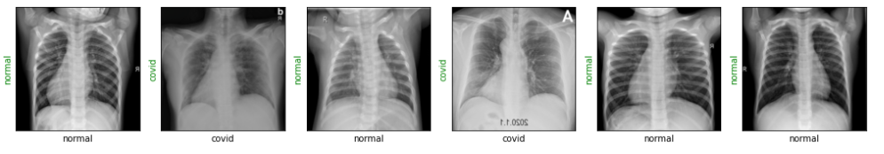
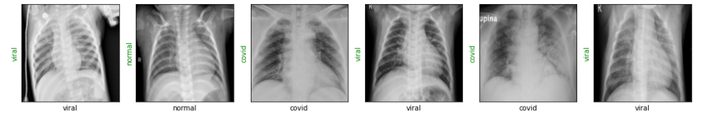
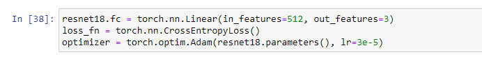
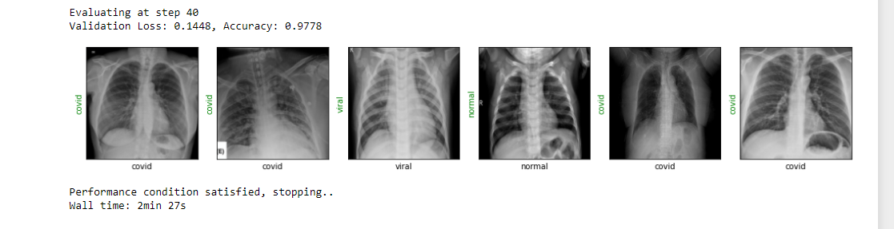

# COVID19
This repository contains COVID19 Detection from XRay Images.
The dataset used for this project was found from Kaggle. This dataset contains XRay images of 3 types of classes:-
1) Covid
2) Normal
3) Viral Pneumonia

This dataset contains database of chest X-ray images for COVID-19 positive cases along with Normal and Viral Pneumonia images.In our current realease, there are 219 COVID-19 positive images, 1341 normal images and 1345 viral pneuomonia images. We will continue to update this database as soon as we have new x-ray images for COVID-19 pneumonia patients. Main objective is to researchers can use this database to produce useful and impactful scholarly work on COVID-19, which can help in tackling this pandemic.

In this project, I have used a ResNet-18 model and train it on a COVID-19 Radiography dataset. This dataset has nearly 3000 Chest X-Ray scans which are categorized in three classes - Normal, Viral Pneumonia and COVID-19. Our objective in this project is to create an image classification model that can predict Chest X-Ray scans that belong to one of the three classes with a reasonably high accuracy.

Please note that this dataset, and the model that we train in the project, can not be used to diagnose COVID-19 or Viral Pneumonia. We are only using this data for educational purpose.

Software,Tools and Frameworks Used:-
1) Anaconda
2) Python
3) Jupyter Notebook
4) PyTorch

Hardware Requirements:-
1) GPU:-  Please note that this dataset, and the model that we train in the project, can not be used to diagnose COVID-19 or Viral Pneumonia. We are only using this data for educational purpose.
2) RAM :- Minimum of 4GB RAM is compulsory but 8GB RAM is recommended.
3) Processor :- Minimum i3 Processor with 7th Generation is recommended.
4) Operating System :- Windows 8 or more, MaxOS, Linux.

Some Images and Visualization from Dataset looks like:-

The accuracy i got in this projects was 97.78%. I have set the program code in such a way that it gets stopped when the accuracy value goes above 95%. The pretrained architecture used for this project was ResNet18 Model. I have removed the last layers of resnet18 model to set our custom layer with 3 output layer.
The loss used for this model was CrossEntropyLoss with Adam as an optimizer

